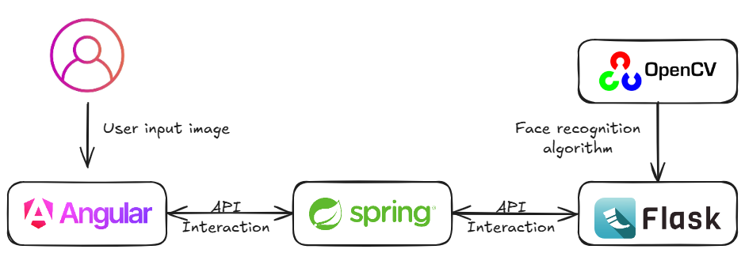
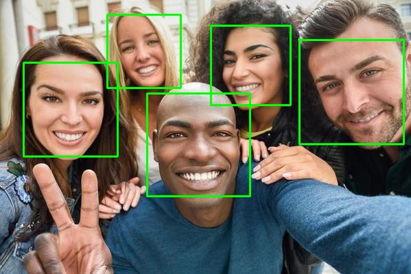

# 🎯 Sistema de Detecção Facial

Portfólio de um sistema completo de detecção facial usando arquitetura de microserviços, composto por três componentes principais: uma interface de usuário em Angular, uma API middleware em Spring Boot, e um serviço de processamento de imagens em Flask/Python.

## 📋 Visão Geral

Este repositório central contém a documentação e os links para os três componentes que formam o sistema de detecção facial. Juntos, esses componentes permitem aos usuários carregar imagens, processá-las para detectar faces usando algoritmos de visão computacional, e visualizar os resultados com marcações visuais.

## 🏗️ Arquitetura

O sistema segue uma arquitetura de microserviços com três componentes principais:

1. **Frontend (Angular)** - Interface de usuário para upload de imagens e visualização de resultados
2. **API Middleware (Spring Boot)** - Camada intermediária para roteamento e tratamento de requisições
3. **Serviço de Detecção Facial (Flask/Python)** - Núcleo de processamento que realiza a detecção facial

## 🚀 Componentes do Sistema

### 1. Interface de Usuário Angular

Aplicação frontend desenvolvida em Angular para permitir o upload de imagens e visualização dos resultados da detecção facial.

**Principais recursos:**
- Interface intuitiva para upload de imagens
- Visualização em tempo real da imagem selecionada
- Exibição do número de rostos detectados
- Visualização da imagem processada com marcações

**Repositório:** [Face Detection UI Angular](#) <!-- Link será adicionado posteriormente -->

[Mais detalhes sobre o componente Angular](README-angular.md)

### 2. API Middleware Spring Boot

API REST em Java que atua como middleware entre o frontend e o serviço de processamento de imagens, gerenciando requisições e respostas.

**Principais recursos:**
- Encaminhamento de imagens para processamento
- Tratamento de múltiplos formatos de imagem
- Exposição de informações via cabeçalhos HTTP personalizados
- Tratamento de erros robusto

**Repositório:** [Face Detection API Java](#) <!-- Link será adicionado posteriormente -->

[Mais detalhes sobre o componente Spring Boot](README-Spring.md)

### 3. Serviço de Detecção Facial Python/Flask

Microserviço Python especializado na detecção de rostos em imagens usando OpenCV e algoritmos Haar Cascade.

**Principais recursos:**
- Detecção automática de rostos em imagens
- Processamento de imagens em formato base64
- Retorno de imagens anotadas com retângulos
- Contagem do número de rostos detectados

**Repositório:** [Face Detection Core Python](#) <!-- Link será adicionado posteriormente -->

[Mais detalhes sobre o componente Flask](README-Flask.md)

## 🖼️ Exemplo de Uso

### Imagem Original (Entrada)

### Imagem Processada (Saída)

> **Observação:** O resultado da detecção pode variar dependendo da imagem de entrada. Para ajustar a sensibilidade e precisão da detecção, é possível configurar os parâmetros do algoritmo HaarCascade no serviço Flask, como scaleFactor, minNeighbors e minSize.

## 🛠️ Como Executar o Sistema Completo

Para executar o sistema completo, você precisa iniciar cada componente separadamente:

1. **Inicie o serviço de detecção facial (Python/Flask)**
   

2. **Inicie a API middleware (Spring Boot)**

3. **Inicie a interface de usuário (Angular)**

4. **Acesse a aplicação**
   - Abra seu navegador e acesse `http://localhost:4200`

## 📄 Licença

Este projeto está sob a licença MIT.

## 👥 Autor

- **Carlos Alfredo Oliveira de Lima** - [GitHub](https://github.com/CarlosAlfredoOliveiraDeLima)

---

⭐ **Gostou do projeto? Deixe uma estrela!** ⭐
